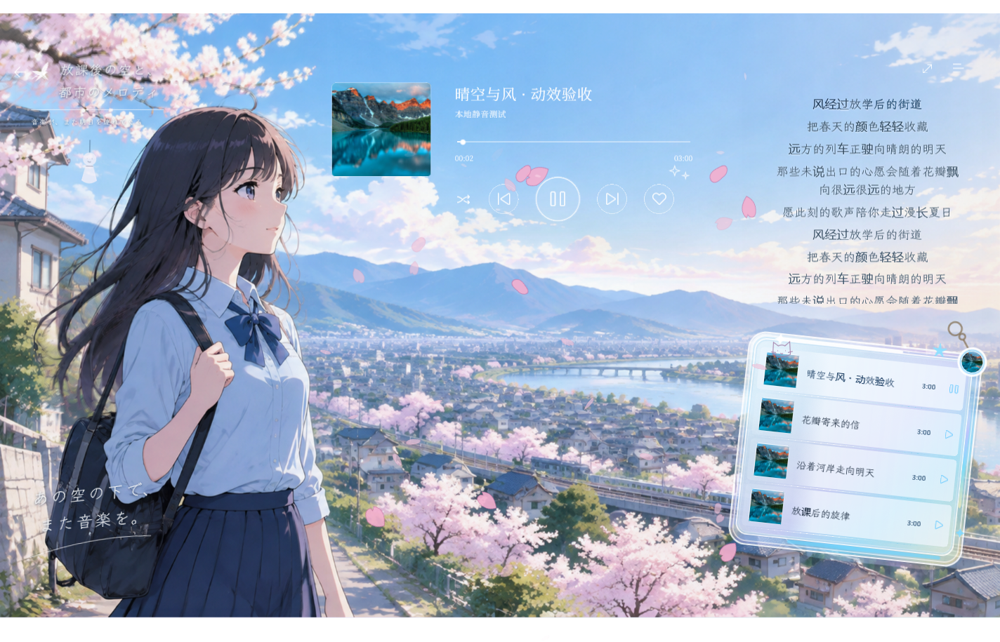

# Beans Music · Three Platform Edition

<p align="center">
  
</p>

Beans Music 是一个面向 iPhone、Mac 和 Windows 11 的开源音乐客户端工程。仓库同时维护 Apple 客户端、Windows 原生重构版，以及可选的自托管 Beans 账号服务。

当前版本重点不是把同一套界面机械复制到三端，而是在共享账号、安全和音乐数据边界的前提下，为每个平台保留合适的原生交互。

## 项目来源与二次开发声明

> 本仓库是对 **[XIaodou0416/Beans-Music](https://github.com/XIaodou0416/Beans-Music)** 的独立二次开发，不是原项目的官方发行版。
>
> 二次开发起点为原仓库提交 **3617004**。原作者版权信息、MIT License 和原仓库地址均予以保留。本仓库新增功能、构建产物、问题反馈和维护决定不代表原作者立场。

- 原始仓库：https://github.com/XIaodou0416/Beans-Music
- 当前二改仓库：https://github.com/lgcr12/Beans-Music-Three-Platform
- 详细差异：[docs/二次开发说明.md](docs/二次开发说明.md)

## Windows 专区与界面预览

Windows 主线不是“只有一个播放器的壳”，而是把内容入口拆成两个一级专区：**二次元专区负责番剧与主题曲内容，发现专区负责 QQ 音乐 / 网易云音乐的日常发现**。两个专区共享账号、缓存、队列和全局播放器，点击任意主题曲或歌单都能继续在同一条播放链路中播放。

### 二次元专区：项目的主视觉与主要差异化功能


二次元专区围绕一条清晰路径组织内容：**番剧作品 → 季度/系列版本 → OP、ED 与插曲 → 平台曲目匹配 → 播放、歌词和收藏**。它不是给普通歌单换一张动漫背景，而是一个独立的动漫音乐资料空间。

#### 放送首页

- 用 Hero 场景承载当前主题，展示近期放送、历史上的今天和今日主题曲。
- 主题曲条目显示作品名、季度、OP/ED/插曲类型、演唱者和匹配状态。
- 已匹配到 QQ 音乐或网易云音乐的曲目可以直接播放；没有匹配结果时进入作品详情，不显示虚假的“可播放”状态。
- 首页内容从本地精选快照开始渲染，再在后台更新 Bangumi 公开资料和平台匹配结果，弱网时仍能打开基础页面。

#### 番剧索引与系列关系

- 支持中文名、日文名、罗马音和别名搜索。
- 支持按年份、题材筛选，以及“最新放送 / 最早放送 / 作品名称”排序。
- 将前传、续集、番外篇、总集篇和不同季度版本归并到同一系列，避免同一部作品在索引中重复出现。
- 详情页保存简介、海报、背景图、首播年份、题材和 Bangumi / 官方链接，并继续加载该系列的其他版本。

#### 我的收藏

- 番剧收藏与主题曲收藏分开管理，可按作品名、日文名、罗马音、曲名和歌手过滤。
- 收藏曲目可以直接加入全局队列、打开歌词或回到作品详情。
- 收藏状态写入本地 Anime 会话，和普通音乐收藏、Beans 云端同步边界保持分离。

#### 二次元动态播放器

下面是当前 Windows 主线的真实运行截图，展示夏日海岸与春樱两套播放器场景：

<p align="center">
  
  
</p>

- 背景、云层、水面、头发、衣摆、树叶和花瓣拆成独立图层，由 Windows Composition 动画控制。
- 播放暂停时动画渐停；窗口最小化时停止刷新；系统启用“减少动效”时自动降低场景运动。
- 播放器仍然提供进度、音量、随机、循环、歌词和队列控制，不牺牲音乐播放器的基本功能。
- 主题曲从二次元专区进入后，仍由共享 `PlaybackService` 播放，可以与普通歌单歌曲混排。

#### 二次元专区的实际使用路径

```text
侧栏「二次元」
  -> 放送首页查看近期番剧与今日主题曲
  -> 番剧索引按作品 / 年份 / 题材搜索
  -> 打开作品详情查看季度版本与 OP / ED
  -> 匹配 QQ 音乐或网易云音乐曲目
  -> 播放、看歌词、加入队列或收藏
```

#### 二次元专区技术实现

| 层级 | 实现 |
| --- | --- |
| 界面 | WinUI 3 动态视图、独立 Anime Shell、浅色动漫主题、Klee One 字体 |
| 目录 | 本地 `catalog-metadata.json` / `recent-calendar.json` 快照 + Bangumi 公共 API |
| 系列 | `AnimeSeriesGrouping` 归并前传、续集、番外和季度版本 |
| 主题曲 | `AnimeThemeSongDiscovery`、`AnimeSongMatcher`，记录平台、版本和匹配置信度 |
| 缓存 | `AnimeDiskCache`、后台预取和取消过期请求 |
| 动效 | `AnimeSceneMotionController`、Composition 分层场景、减少动效策略 |
| 播放 | 共享 `PlaybackService`、歌词服务、队列和系统媒体控制 |

#### 二次元专区界面清单

| 界面 | 用户看到什么 | 可执行操作 |
| --- | --- | --- |
| **Anime Shell 外壳** | 顶部返回按钮、Beans Music 标识、放送首页 / 番剧索引 / 我的收藏三个导航，底部固定主题曲播放器 | 切换子界面、打开沉浸式播放器、调节进度与音量、随机 / 循环、查看队列、切换减少动效 |
| **放送首页** | Hero 场景、搜索框、题材快捷入口、历史上的今天、今日主题曲和轮播场景 | 搜索作品、按题材进入索引、打开作品详情、播放当天主题曲、切换场景 |
| **番剧索引** | 近期放送/搜索结果、年份下拉、题材筛选、排序菜单、作品卡片和加载更多 | 按中文名 / 日文名 / 罗马音搜索，筛选年份与题材，排序，展开系列版本 |
| **系列版本页** | 同一作品的季度、续集、剧场版和其他关联版本卡片 | 返回索引、选择某一版本、进入该版本详情；网络更新后显示版本数量和关联状态 |
| **作品详情页** | 大幅海报 Hero、中文名 / 原名、首播年份、类型、简介、外部资料链接、主题曲列表和“继续探索”侧栏 | 播放本季主题曲、加入队列、添加到 Beans 歌单、收藏番剧、筛选 OP / ED / 插曲 / 角色曲、打开其他作品 |
| **动漫搜索页** | “匹配番剧”和“相关主题曲”两块结果区；作品结果按系列归并，曲目结果可按类型过滤 | 重新搜索、展开系列、播放 / 排队已匹配曲目、收藏主题曲、继续加载到索引 |
| **我的收藏页** | 收藏的番剧卡片、收藏的主题曲列表和统一搜索框 | 按作品 / 日文名 / 罗马音 / 曲名 / 歌手过滤，取消番剧或主题曲收藏，返回作品详情 |
| **动漫歌词页** | 深色沉浸式歌词舞台、作品海报与氛围背景、当前行高亮、翻译歌词和底部进度条 | 返回专题、点击 / 拖动进度、打开歌词设置，调整字号、行距、翻译显示和减少动效 |
| **添加到 Beans 歌单对话框** | 已匹配主题曲选择、Beans 歌单搜索、歌单勾选、新建歌单和重复歌曲提示 | 调整要添加的歌曲，选择多个目标歌单，新建歌单并批量写入；同平台重复歌曲自动跳过 |
| **沉浸式 Anime Player** | 全屏动漫舞台、主题曲封面与标题、歌词列、玻璃播放队列卡、收藏和全屏控制 | 播放 / 暂停、上一首 / 下一首、随机、收藏、打开队列、点击歌词跳转、切换全屏 |

#### 各界面配图与视觉对应

下面按界面列出对应的项目配图。除播放器部分标注为真实运行截图外，其余图片是该界面实际使用的 Hero、海报、背景或卡片素材，不把静态素材伪装成运行截图。

##### Anime Shell 外壳


顶部三段式导航和底部主题曲播放器都覆盖在这套动漫 Shell 之上；点击封面可进入独立沉浸式播放器。

##### 放送首页


放送首页使用宽幅 Hero、题材入口、历史上的今天和今日主题曲卡片，重点是快速进入一部作品。

##### 番剧索引


索引页的作品卡使用同一套动漫视觉，但把重点放在年份、题材、排序、搜索和加载更多。

##### 系列版本页


系列页用作品卡呈现季度、续集、剧场版和其他关联版本，选择卡片后进入对应作品详情。

##### 作品详情页


详情页以大海报、背景图和主题曲列表为主，右侧资料栏承载年份、类型、简介、外部链接和“继续探索”。

##### 动漫搜索页


搜索页把匹配番剧和相关主题曲分成两块，输入中文名、日文名或罗马音后，结果会继续进行系列归并与平台曲目匹配。

##### 我的收藏页


收藏页同时显示收藏番剧卡片和收藏主题曲列表，支持统一关键词过滤、取消收藏和返回作品详情。

##### 动漫歌词页


歌词页切换为深色沉浸舞台，显示作品海报、当前行高亮、翻译歌词和播放进度；歌词设置可以单独调节字号、行距、翻译和减少动效。

##### 添加到 Beans 歌单对话框


对话框使用浅色玻璃风格，提供主题曲勾选、Beans 歌单搜索、多选目标歌单和新建歌单；重复歌曲会自动跳过。

##### 沉浸式 Anime Player

下面两张是当前 Windows 主线的真实运行截图，展示沉浸式播放器的两套季节场景：

<p align="center">
  
  
</p>

### 发现专区：日常听歌入口


发现专区服务于普通音乐浏览，在 QQ 音乐与网易云音乐之间切换，提供排行榜、推荐歌单和歌单广场。页面会显示当前平台授权、刷新、缓存和错误状态；网络不可用时优先读取有效缓存，不把预览内容伪装成个性化推荐。歌单卡片进入详情后，与搜索结果一样交给全局队列和底部播放器。

发现专区的完整数据结构和卡片素材说明见：[Windows 两个专区说明](docs/windows-sections.md)。

### iOS · SwiftUI 客户端

<p align="center">
  
  
  
  
</p>

Apple 截图来自 iOS 目标。Mac Catalyst 目标复用完整 Apple 客户端代码；仓库中的原生 BeansMac 目标则采用独立的桌面三栏布局。

## 平台与技术栈

| 目标 | 工程入口 | 技术栈 | 当前定位 |
| --- | --- | --- | --- |
| iOS 26 | Beans | Swift 5、SwiftUI、AVFoundation、MediaPlayer、GRDB、Argon2Swift、Keychain | 完整移动客户端 |
| macOS 15 原生 | BeansMac | Swift、SwiftUI、AVFoundation | 本地音乐库与桌面三栏播放器 |
| macOS 15 Catalyst | BeansCatalyst | SwiftUI、Mac Catalyst、GRDB、Argon2Swift | 复用完整 Apple 客户端能力 |
| Windows 11 | windows/Beans.Windows.Rebuild | C#、.NET 10、WinUI 3、Windows App SDK 2.5、MediaPlayer、WebView2、Credential Locker | 当前 Windows 主线客户端 |
| Beans 服务 | server/Beans.Api | ASP.NET Core 10、EF Core、PostgreSQL 17、Redis 7.4、JWT、Caddy、Docker Compose | 可选的账号与加密同步服务 |

Windows 当前主线是 **Beans.Windows.Rebuild**。仓库中的 **windows/Beans.Windows** 属于较早的 Windows 实现，保留用于历史兼容和迁移对照。

## 主要功能

### 音乐发现与资料库

- 聚合 QQ 音乐与网易云音乐的公开发现、榜单、搜索和歌单信息。
- 支持本地音乐目录扫描、元数据回退、同名 LRC 关联和缺失文件状态。
- 平台数据、缓存、授权状态和错误提示彼此隔离，不把预览数据伪装成在线数据。
- Beans 自建歌单支持本地持久化；第三方歌单按平台能力保持只读或受限操作。

### 播放体验

- 单播放器实例管理队列、播放进度、音量、随机、循环和系统媒体控制。
- 在线歌曲通过平台授权边界解析官方可播放地址；无权限或受限制内容不会伪装成成功。
- 在线与本地歌词、翻译行合并、逐行高亮和播放跳转。
- Windows 提供玻璃歌单、动态播放器、封面氛围、二次元入口和页面转场。
- iOS 提供播放器布局、主题、歌词样式、壁纸和氛围效果等深度自定义能力。

### 账号、安全与同步

- Beans 邮箱注册、验证、登录、令牌轮换、设备管理和扫码登录。
- Apple 平台凭证保存于 Keychain；Windows 平台凭证保存于 Credential Locker / DPAPI 边界。
- Argon2id / HKDF 密钥派生、AES-256-GCM 加密保险库，以及离线 outbox 和增量同步。
- 服务端不保存第三方平台明文 Cookie，不代理音乐接口或音频流。
- 不登录 Beans 账号时，QQ 音乐、网易云音乐和本地播放仍可按各端实现独立使用。

### 平台能力概览

| 能力 | iOS | macOS Catalyst | macOS 原生 | Windows |
| --- | :---: | :---: | :---: | :---: |
| QQ / 网易云发现与搜索 | ✓ | ✓ | — | ✓ |
| 本地音乐播放 | ✓ | ✓ | ✓ | ✓ |
| Beans 账号与加密同步 | ✓ | ✓ | — | ✓ |
| 深度主题与播放器自定义 | ✓ | ✓ | 基础 | ✓ |
| 动态二次元播放器 | — | — | — | ✓ |
| 桌面三栏布局 | — | 适配 | ✓ | ✓ |

## 快速开始

### 1. 获取源码

~~~bash
git clone https://github.com/lgcr12/Beans-Music-Three-Platform.git
cd Beans-Music-Three-Platform
~~~

### 2. iOS

要求：

- macOS
- Xcode 26 或包含目标 iOS SDK 的兼容版本
- XcodeGen

~~~bash
brew install xcodegen
xcodegen generate
open Beans.xcodeproj
~~~

命令行结构构建：

~~~bash
xcodebuild -project Beans.xcodeproj -scheme Beans -configuration Debug \
  -sdk iphonesimulator CODE_SIGNING_ALLOWED=NO build
~~~

iOS 目标 Bundle ID 为 **com.beans.app**。真机安装需要使用自己的开发者签名。

### 3. macOS

生成工程后，可以选择两个 Mac 目标。

原生 SwiftUI 桌面客户端：

~~~bash
xcodebuild -project Beans.xcodeproj -scheme BeansMac -configuration Debug build
~~~

完整 Apple 功能的 Mac Catalyst 客户端：

~~~bash
xcodebuild -project Beans.xcodeproj -scheme BeansCatalyst -configuration Debug \
  -destination 'generic/platform=macOS,variant=Mac Catalyst' build
~~~

### 4. Windows 11

要求：

- Windows 11 22H2 或更高版本
- .NET SDK 10.0.401 或兼容的 10.0 SDK
- Visual Studio 的 Windows 应用开发 / WinUI 工作负载；仅命令行构建时也可使用仓库已配置的 SDK

~~~powershell
Set-Location .\windows\Beans.Windows.Rebuild

dotnet restore '.\Beans.Windows.Rebuild.slnx'
dotnet build '.\Beans.Windows.Rebuild.slnx' -c Debug --no-restore
dotnet test '.\Tests\Beans.Windows.Rebuild.Tests.csproj' -c Debug --no-restore
& '.\Start-BeansMusic.cmd' --debug
~~~

Windows 客户端为非打包 WinUI 3 应用，首次构建会在项目内独立恢复 NuGet 依赖。

### 5. 可选的 Beans 账号服务

要求 Docker Desktop 或兼容的 Docker Compose 环境。

~~~bash
cp server/.env.example server/.env
docker compose --env-file server/.env -f server/compose.yaml up --build
~~~

开发环境默认包含：

- Beans API：容器内 8080，由 Caddy 暴露
- PostgreSQL：账号、设备和加密同步元数据
- Redis：缓存与一次性流程状态
- Mailpit：http://localhost:8025

请在 **server/.env** 中设置 PostgreSQL 密码和 JWT 签名密钥。不要把真实密钥、Cookie、证书或签名文件提交到仓库。

## 目录结构

~~~text
Beans/                              iOS 与 Mac Catalyst 共享客户端
BeansMac/                           独立原生 macOS 客户端
windows/Beans.Windows.Rebuild/      当前 Windows 11 WinUI 3 主线
windows/Beans.Core/                 Windows 共享业务与同步核心
server/Beans.Api/                   ASP.NET Core 账号服务
contracts/                          OpenAPI 与跨端契约
design/                             品牌与设计源文件
docs/                               架构、二改说明和截图
.github/workflows/                  三端构建与分平台发布流程
~~~

## 构建与发布约定

- iOS Release 标签：**ios-vX.Y.Z**
- macOS Release 标签：**mac-vX.Y.Z**
- Windows Release 标签：**windows-vX.Y.Z**
- 三个平台分别生成自己的安装产物，不进行可执行代码热更新。
- 主题、图片等非可执行资源可以独立演进，但必须保留来源与许可信息。

现有 Windows MSIX 发布工作流仍指向历史工程 **windows/Beans.Windows**；当前 **Beans.Windows.Rebuild** 是非打包开发主线，完成打包迁移前请按上面的命令直接构建和运行。

截至 2026-09-28，Windows 重构版的本地验证结果为 **467 项测试全部通过**，Release 构建为 **0 警告、0 错误**。

## 使用边界

- 本项目仅用于个人学习、技术研究和非商业交流。
- QQ 音乐、网易云音乐及其内容、商标和服务归对应权利人所有。
- 播放能力取决于用户账号权益、有效授权、地区限制和平台风控。
- 项目不提供音频存储服务，不应被用于绕过会员、版权或数字内容保护。
- 使用者应自行遵守所在地法律以及第三方平台的服务条款。

## License

本项目沿用 [MIT License](LICENSE)。原作者与二次开发者的版权声明以仓库历史、License 和第三方声明文件为准。
